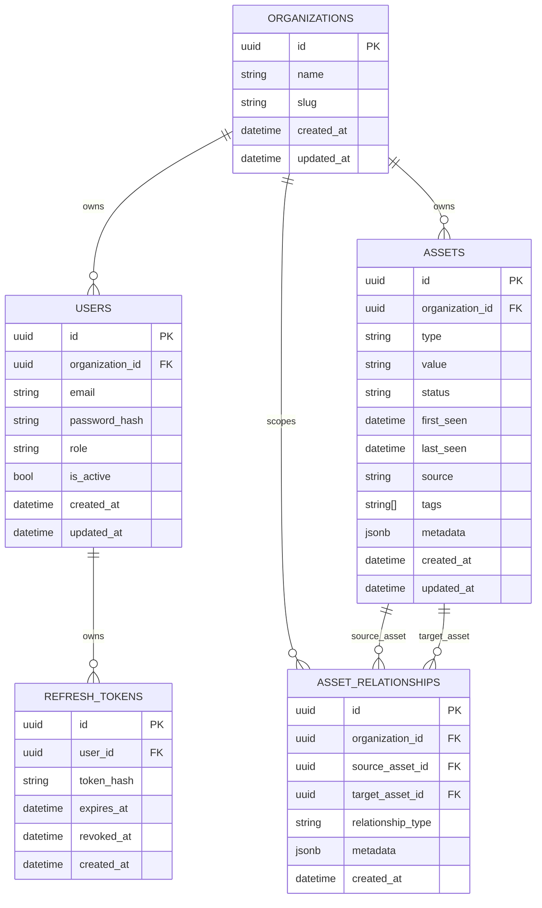

# Asset Management Backend — Spec Kit Implementation Phases

## Executive Summary

This project implements the Backend Engineering track for the Buguard DarkAtlas Asset Management internship task. The system will be a production-minded FastAPI + PostgreSQL API for storing, importing, deduplicating, querying, and relating attack-surface assets such as domains, subdomains, IP addresses, services, certificates, and technologies.

The implementation will use Spec Kit as the main development workflow. Each phase will be implemented using a spec-driven process: define the feature specification, clarify requirements, create a technical plan, generate implementation tasks, analyze consistency, implement, test, and commit.

The repository has already been initialized with Git, GitHub, uv, and Spec Kit. Phase 1 has already been implemented and must remain unchanged in this plan.

The goal is to satisfy the mandatory backend requirements while still demonstrating production-level backend thinking through organization-level tenant isolation, JWT authentication, refresh tokens, role-based access control, relationship graph modeling, CI, rate limiting, optional caching, optional graph visualization, and one optional LangChain-powered backend analysis feature.

This plan deliberately keeps authentication and organization onboarding simple so implementation effort stays focused on the core Asset Management backend. Organizations and users are seeded for development and evaluation. Each user belongs to exactly one organization and has one role in that organization. The system is still multi-tenant because all tenant-owned data is scoped by `organization_id`, and every tenant-owned query derives `organization_id` from the authenticated user context.

---

## Key Assumptions

The following assumptions are part of the project scope and should also be documented in the final README.

### 1. Public user registration is out of scope

The API will not implement:

```txt
POST /auth/register
```

Users are created through a seed script for local development and evaluator testing.

### 2. Public organization creation is out of scope

The API will not implement:

```txt
POST /organizations
```

Organizations are created through a seed script.

### 3. Users and organizations are seeded

The project will include:

```txt
scripts/seed.py
```

The seed script should create:

```txt
Demo organization
Admin user
Analyst user
Viewer user
Second organization for tenant isolation tests
Second organization admin user
```

Example seeded users:

```txt
admin@example.com   / password123
analyst@example.com / password123
viewer@example.com  / password123
other-admin@example.com / password123
```

### 4. Each user belongs to exactly one organization

Each user has one `organization_id` stored directly on the `users` table.

There is no `memberships` table in this implementation.

### 5. Each user has one role within their organization

Each user has one role stored directly on the `users` table.

Supported roles:

```txt
viewer
analyst
admin
```

Permissions:

```txt
viewer:
- read assets
- read relationships
- read graph

analyst:
- viewer permissions
- create assets
- update assets
- bulk import assets
- mark assets stale
- create relationships

admin:
- analyst permissions
- delete/archive assets
```

### 6. Multi-tenancy is enforced at the organization data level

The system supports multiple organizations. Tenant-owned resources include:

```txt
assets
asset_relationships
```

Each tenant-owned record stores:

```txt
organization_id
```

### 7. `organization_id` always comes from authentication context

Clients must never provide `organization_id` when creating or modifying tenant-owned resources.

The backend always derives `organization_id` from the authenticated user’s JWT/current-user context.

### 8. JWT access tokens include organization and role context

Access tokens include:

```json
{
  "sub": "user_id",
  "organization_id": "user_organization_id",
  "role": "user_role",
  "exp": 1234567890
}
```

Because each user belongs to exactly one organization, there is no active organization switching in this version.

### 9. All tenant-owned queries are organization-scoped

Every query for assets or relationships must filter by the authenticated user’s organization.

Example:

```sql
WHERE organization_id = current_user.organization_id
```

This prevents users from one organization from seeing or modifying another organization’s data.

### 10. Asset deduplication is scoped per organization

Two different organizations may have the same asset value.

Therefore, asset uniqueness is enforced using:

```sql
UNIQUE (organization_id, type, value)
```

This means Organization A and Organization B can both have `api.example.com`, but the same organization cannot create duplicate copies of the same asset.

### 11. Relationships cannot cross organizations

Asset relationships may only connect assets that belong to the same organization.

The backend must reject any attempt to create a relationship where the source and target assets belong to different organizations.

### 12. SaaS user management is out of scope

The project does not implement:

```txt
user invitations
email verification
password reset
organization admin panels
team management
billing
```

These are valid SaaS features, but they are outside the scope of this Asset Management backend assessment.

### 13. Organization switching is a future enhancement

Supporting users with different roles across multiple organizations is intentionally out of scope.

A future version could introduce:

```txt
memberships table
organization switching endpoint
one access token per active organization context
```

### 14. The sample dataset is imported through the bulk import endpoint

No live scanning or external asset discovery is implemented.

The system assumes assets are provided through the sample JSON dataset and imported using:

```txt
POST /assets/import
```

### 15. Core backend features take priority over bonuses

If time becomes limited, the priority is:

```txt
asset CRUD
filtering
sorting
pagination
bulk import
deduplication
lifecycle handling
relationships
tests
Docker Compose
README
```

Bonus features such as graph visualization, caching, rate limiting, CI, and LangChain should not compromise the correctness of the mandatory backend requirements.

---

## Global Architecture Target

### Core Stack

* Python
* FastAPI
* PostgreSQL
* SQLAlchemy 2.0
* Alembic
* Pydantic v2
* uv for dependency and virtual environment management
* Pytest for automated testing
* Docker Compose for local reproducibility
* GitHub Actions for CI

### Stretch / Bonus Stack

* JWT authentication
* Refresh token rotation
* Role-based access control
* Multi-tenant organization scoping
* Redis or in-memory backend for optional caching/rate limiting
* LangChain for one grounded AI analysis feature
* Simple graph visualization for asset relationships

---

## Spec Kit Workflow Per Phase

Each phase should follow this general Spec Kit flow:

```txt
/speckit.specify
/speckit.clarify
/speckit.checklist
/speckit.plan
/speckit.tasks
/speckit.analyze
/speckit.implement
```

Each phase should end with:

* Passing tests for the implemented scope
* Updated README notes if relevant
* A clean git commit
* No broken main branch

---

# Phase 1 — Project Foundation, Dependencies, and Infrastructure

## Goal

Establish the FastAPI backend foundation using the already initialized GitHub repository, uv environment, and Spec Kit setup.

This phase creates the base app structure, installs dependencies, configures Docker Compose, connects PostgreSQL, initializes Alembic, adds configuration management, and creates the first health-check test.

## Scope

### Add Production Dependencies

```bash
uv add fastapi uvicorn[standard] sqlalchemy asyncpg alembic pydantic-settings python-jose[cryptography] passlib[bcrypt] python-multipart
```

### Add Development Dependencies

```bash
uv add --dev pytest pytest-asyncio httpx ruff mypy
```

### Optional Dependencies for Later Phases

Do not add these immediately unless the relevant phase requires them:

```bash
uv add slowapi redis langchain langchain-openai
```

### Create Initial Project Structure

```txt
app/
  __init__.py
  main.py

  core/
    __init__.py
    config.py
    security.py
    errors.py

  db/
    __init__.py
    session.py
    base.py

  api/
    __init__.py
    deps.py
    routes/
      __init__.py
      health.py

  models/
    __init__.py

  schemas/
    __init__.py

  services/
    __init__.py

  repositories/
    __init__.py

tests/
  __init__.py
  test_health.py

alembic/
docker-compose.yml
Dockerfile
.env.example
README.md
```

### Initial Endpoint

Add:

```txt
GET /health
```

Expected response:

```json
{
  "status": "ok"
}
```

### Docker Compose

Create services for:

```txt
api
db
```

The API should connect to PostgreSQL through `DATABASE_URL`.

### Alembic

Initialize and configure Alembic so future SQLAlchemy models can generate migrations.

## Suggested Spec Kit Prompt

```txt
/speckit.specify
Phase 1: Build the backend foundation for the Asset Management API. The repository is already initialized with Git, GitHub, uv, and Spec Kit. Add FastAPI, SQLAlchemy, asyncpg, Alembic, Pydantic settings, pytest, httpx, ruff, mypy, and supporting dependencies. Create a clean application structure with app/main.py, configuration, database session setup, health route, tests, Dockerfile, docker-compose.yml with PostgreSQL, .env.example, and README setup notes. The app must run locally with uv and through docker compose.
```

## Deliverables

* FastAPI app boots successfully
* `GET /health` works
* PostgreSQL runs through Docker Compose
* SQLAlchemy async session setup exists
* Alembic is configured
* Basic health test passes
* README includes setup commands
* `.env.example` exists
* `uv.lock` is committed

## Acceptance Criteria

Run locally:

```bash
uv run uvicorn app.main:app --reload
```

Run tests:

```bash
uv run pytest
```

Run Docker:

```bash
docker compose up --build
```

Open:

```txt
http://localhost:8000/health
```

Expected:

```json
{
  "status": "ok"
}
```

---

# Phase 2 — Multi-Tenant Data Model, Seeded Users, JWT Auth, Refresh Tokens, and RBAC

## Goal

Build the security and data ownership foundation without adding unnecessary SaaS onboarding complexity.

This phase implements organization-scoped multi-tenancy, seeded users, JWT access tokens, refresh tokens, and role-based access control.

There is no public registration endpoint and no public organization creation endpoint in this project.

## Scope

Create models and migrations for:

```txt
organizations
users
refresh_tokens
assets
asset_relationships
```

Do not create:

```txt
memberships
```

Do not implement:

```txt
POST /auth/register
POST /auth/switch-organization
POST /organizations
```

## ERD



## Important Constraints

Assets:

```sql
UNIQUE (organization_id, type, value)
```

Relationships:

```sql
UNIQUE (
  organization_id,
  source_asset_id,
  target_asset_id,
  relationship_type
)
```

Users:

```sql
UNIQUE (email)
```

Organizations:

```sql
UNIQUE (slug)
```

Users belong to exactly one organization through `users.organization_id`.

Each user has one organization-level role stored on the user record.

## Recommended Indexes

```sql
assets (organization_id, type)
assets (organization_id, status)
assets (organization_id, last_seen)
assets (organization_id, value)
asset_relationships (organization_id, source_asset_id)
asset_relationships (organization_id, target_asset_id)
users (email)
users (organization_id)
refresh_tokens (user_id)
```

## Auth Endpoints

Implement only:

```txt
POST /auth/login
POST /auth/refresh
POST /auth/logout
GET  /auth/me
```

Do not implement registration.

## Seed Script

Add:

```txt
scripts/seed.py
```

The seed script should create:

```txt
Demo organization
Admin user
Analyst user
Viewer user
Second organization for tenant isolation tests
Second organization admin user
```

Example seeded users:

```txt
admin@example.com / password123
analyst@example.com / password123
viewer@example.com / password123
other-admin@example.com / password123
```

## Roles

Use three roles:

```txt
admin
analyst
viewer
```

## Permissions

```txt
viewer:
- read assets
- read relationships
- read graph

analyst:
- viewer permissions
- create assets
- update assets
- bulk import assets
- mark assets stale
- create relationships

admin:
- analyst permissions
- delete/archive assets
```

## JWT Payload

Access tokens should include:

```json
{
  "sub": "user_id",
  "organization_id": "user_organization_id",
  "role": "user_role",
  "exp": 1234567890
}
```

## Multi-Tenant Rule

Never accept `organization_id` from client input for tenant-owned resources.

Always derive it from:

```txt
authenticated user/JWT organization_id
```

Every repository query for tenant-owned data must filter by `organization_id`.

Every asset belongs to an organization.

Every asset relationship belongs to an organization.

Asset relationships must only connect assets from the same organization.

Cross-organization asset access should return `404 Not Found` or `403 Forbidden`, depending on the project's error strategy.

## Refresh Token Rules

* Store only a hash of the refresh token.
* Refresh token must expire.
* Logout revokes the refresh token.
* Refresh endpoint rejects expired or revoked tokens.
* Prefer refresh token rotation if time allows.
* Never log raw refresh tokens.

## Suggested Spec Kit Prompt

```txt
/speckit.specify
Phase 2: Implement the multi-tenant database model, seeded users, JWT authentication, refresh tokens, and role-based access control. Do not implement public registration or organization onboarding. Organizations and users are seeded for development and evaluation. Each user belongs to exactly one organization and has one role. Assets and relationships must be scoped by organization_id. Login returns a short-lived JWT access token and a longer-lived refresh token. Access tokens include user id, organization id, and role. Write operations require analyst or admin. Delete operations require admin. Refresh tokens must be stored hashed, support logout revocation, and never be logged.
```

## Deliverables

* SQLAlchemy models
* Alembic migrations
* Auth schemas
* Auth routes
* Password hashing
* JWT creation and verification
* Refresh token hashing and storage
* RBAC dependencies
* Tenant-aware current user dependency
* Seed script
* README seed instructions
* Tests for auth, refresh tokens, RBAC, and tenant isolation

## Acceptance Criteria

* Migrations apply successfully.
* Organizations can be seeded.
* Users can be seeded.
* Each user belongs to exactly one organization.
* A user has exactly one role.
* There is no `/auth/register` endpoint.
* There is no `/organizations` endpoint.
* A seeded user can log in.
* Login returns access and refresh tokens.
* JWT access tokens include user id, organization id, and role.
* Protected routes reject unauthenticated users.
* Viewer cannot perform write operations.
* Analyst can perform write operations except delete.
* Admin can delete/archive.
* Refresh token can issue a new access token.
* Logout revokes refresh token.
* Two organizations can store identical asset values independently.
* One organization cannot access another organization’s assets.

---

# Phase 3 — Asset CRUD, Filtering, Sorting, Pagination, and Error Handling

## Goal

Implement the core asset API with professional validation, structured errors, tenant scoping, and OpenAPI documentation.

This combines CRUD and API polish because validation and error handling should be built into the routes from the beginning rather than added later.

## Scope

Endpoints:

```txt
POST   /assets
GET    /assets
GET    /assets/{asset_id}
PATCH  /assets/{asset_id}
DELETE /assets/{asset_id}
```

## Filtering

Support:

```txt
type
status
tag
value_contains
source
```

## Sorting

Support:

```txt
sort_by=value
sort_by=type
sort_by=status
sort_by=first_seen
sort_by=last_seen
sort_by=created_at

sort_order=asc
sort_order=desc
```

## Pagination

Support:

```txt
page
page_size
```

Recommended defaults:

```txt
page = 1
page_size = 20
max_page_size = 100
```

## Error Shape

Use consistent structured errors where custom domain errors are needed:

```json
{
  "error": {
    "code": "ASSET_NOT_FOUND",
    "message": "Asset not found",
    "details": {}
  }
}
```

## Multi-Tenant Rule

Every asset query must include:

```txt
organization_id = current_user.organization_id
```

The API must never accept `organization_id` in asset create/update request bodies.

## Suggested Spec Kit Prompt

```txt
/speckit.specify
Phase 3: Implement tenant-scoped asset CRUD with filtering, sorting, pagination, validation, structured errors, and OpenAPI polish. All asset operations must derive organization_id from the authenticated user context. The list endpoint must support filtering by type, status, tag, source, and value_contains, plus sorting and pagination. Viewer users may read assets, analyst/admin users may create and update assets, and only admin users may delete or archive assets.
```

## Deliverables

* Asset schemas
* Asset routes
* Asset service
* Asset repository
* Pagination response schema
* Custom error utilities
* OpenAPI tags and route summaries
* Tests for CRUD, filters, sorting, pagination, RBAC, validation, and tenant isolation

## Acceptance Criteria

* Assets can be created, listed, read, updated, and deleted/archived.
* Asset create/update payloads do not accept `organization_id`.
* List endpoint does not return assets from other organizations.
* Filtering works.
* Sorting works.
* Pagination works.
* Write routes require correct role.
* Invalid asset type/status returns validation error.
* Missing asset returns structured 404.
* Forbidden action returns structured 403.
* Swagger UI is readable.

---

# Phase 4 — Bulk Import, Deduplication, Lifecycle Handling, and Import Edge Cases

## Goal

Implement the most important ASM-specific backend behavior: idempotent, lifecycle-aware asset ingestion.

This phase focuses on making the system behave like a real asset inventory rather than a simple CRUD API.

## Scope

Endpoint:

```txt
POST /assets/import
```

Add or support:

```txt
POST /assets/{asset_id}/mark-stale
```

or:

```txt
PATCH /assets/{asset_id}
{
  "status": "stale"
}
```

## Import Behavior

For each imported asset:

If asset does not exist within the organization:

```txt
create it
set first_seen
set last_seen
set status
```

If asset already exists within the organization:

```txt
do not create duplicate
preserve first_seen
update last_seen
merge tags
merge metadata
set status to active if re-sighted
```

## Partial Failure Handling

Malformed records should not crash the entire batch.

Return a summary:

```json
{
  "created": 10,
  "updated": 4,
  "failed": 2,
  "errors": [
    {
      "index": 3,
      "reason": "Missing value"
    }
  ]
}
```

## Lifecycle Rules

* `first_seen` is set only once.
* `last_seen` is updated on every re-sighting.
* `active` means currently observed.
* `stale` means previously observed but not recently seen.
* `archived` means removed from active operational use.
* A stale asset seen again becomes active.

## Edge Cases

Handle:

* Same dataset imported twice
* Same asset with conflicting metadata
* Same asset with new tags
* Stale asset reappearing
* Malformed or partial records
* Large import batches
* Organization isolation during import

## Suggested Spec Kit Prompt

```txt
/speckit.specify
Phase 4: Implement tenant-scoped bulk import, deduplication, lifecycle handling, and import edge cases. Importing the same dataset twice must not create duplicates. Existing assets are matched by organization_id, type, and canonical value. Re-sighted assets preserve first_seen, update last_seen, merge tags and metadata, and become active again if stale. Malformed records should be reported in the import response without crashing the entire batch.
```

## Deliverables

* Import schemas
* Import route
* Import service
* Deduplication logic
* Metadata merge strategy
* Tag merge strategy
* Lifecycle handling
* Import summary response
* Tests for idempotent import, conflicting metadata, malformed records, stale reactivation, and tenant isolation

## Acceptance Criteria

* Importing the same dataset twice does not increase asset count.
* Import payloads do not accept or trust `organization_id`.
* Tags are merged without duplicates.
* Metadata is merged predictably.
* Malformed records are reported without crashing the batch.
* Stale assets become active when imported again.
* Import cannot affect another organization’s assets.
* `first_seen` is preserved on re-import.
* `last_seen` changes on re-import.

---

# Phase 5 — Asset Relationships, Graph Endpoint, and Graph Visualization

## Goal

Implement the asset relationship graph and optionally add a simple visualization powered by the graph API.

This phase combines relationship modeling and visualization because the visualization should consume the same graph endpoint used by the API.

## Scope

Endpoints:

```txt
POST /relationships
GET  /relationships
GET  /assets/{asset_id}/graph
```

Optional visualization route:

```txt
GET /graph-view
```

or a static HTML page served by the app.

## Relationship Examples

```txt
subdomain belongs_to domain
subdomain resolves_to ip_address
service runs_on ip_address
certificate covers subdomain
technology detected_on service
technology detected_on subdomain
```

## Relationship Safety Rules

When creating a relationship:

* Source asset must exist.
* Target asset must exist.
* Both assets must belong to the current organization.
* Relationship must be scoped to the current organization.
* Duplicate relationships should not be created.
* Relationship creation payloads must not accept or trust `organization_id`.

## Graph Response Shape

```json
{
  "center": {
    "id": "asset-id",
    "type": "subdomain",
    "value": "api.example.com"
  },
  "nodes": [
    {
      "id": "asset-id",
      "type": "subdomain",
      "label": "api.example.com"
    }
  ],
  "edges": [
    {
      "source": "asset-id-1",
      "target": "asset-id-2",
      "relationship_type": "resolves_to"
    }
  ]
}
```

## Visualization Requirements

The visualization should:

* Accept or use an asset ID.
* Fetch the graph endpoint.
* Display nodes and edges.
* Label nodes by asset value.
* Label edges by relationship type.
* Avoid duplicating graph logic in the frontend.

## Suggested Spec Kit Prompt

```txt
/speckit.specify
Phase 5: Implement tenant-scoped asset relationships, graph retrieval, and an optional simple graph visualization. Relationships connect two assets using source_asset_id, target_asset_id, and relationship_type. The API must prevent cross-organization relationships. The graph endpoint should return nodes and edges around a selected asset in a visualization-friendly structure. The visualization should consume the graph endpoint and render the relationship graph without duplicating backend graph logic.
```

## Deliverables

* Relationship schemas
* Relationship routes
* Relationship service
* Relationship repository
* Graph response schema
* Optional simple graph visualization
* Tests for relationship creation, duplicate prevention, graph retrieval, cross-tenant blocking, and visualization route if applicable

## Acceptance Criteria

* Relationships can be created between assets in the same organization.
* Duplicate relationships are prevented.
* Cross-tenant relationships are blocked.
* Relationship create payloads do not accept `organization_id`.
* Graph endpoint returns nodes and edges.
* Viewer can read graph.
* Analyst/admin can create relationships.
* Visualization renders a real graph from the API if implemented.

---

# Phase 6 — Test Suite, CI, Rate Limiting, and Optional Caching

## Goal

Strengthen the project with automated quality checks, continuous integration, and security-aware abuse prevention.

This phase combines testing, CI, and operational polish because they all support reliability and production-readiness.

## Scope

## Test Coverage

Add tests for:

```txt
health check
seed script
seeded login
refresh tokens
RBAC
tenant isolation
asset CRUD
filtering
sorting
pagination
bulk import
deduplication
metadata merge
tag merge
lifecycle handling
relationships
graph endpoint
structured errors
```

## CI Pipeline

Add:

```txt
.github/workflows/tests.yml
```

Run:

```txt
uv run ruff check .
uv run pytest
```

Optional:

```txt
uv run mypy app
```

## Rate Limiting

Rate limit abuse-prone endpoints:

```txt
POST /auth/login
POST /auth/refresh
POST /assets/import
```

Later, if the AI endpoint is implemented:

```txt
POST /analysis/report
```

Suggested limits:

```txt
/auth/login       5 per minute
/auth/refresh     10 per minute
/assets/import    10 per minute
/analysis/report  5 per minute
```

## Optional Caching

Cache only organization-scoped read endpoints if implemented:

```txt
GET /assets
GET /assets/{asset_id}/graph
```

Cache keys must include:

```txt
organization_id
```

Cache must be invalidated after:

```txt
asset create/update/delete
bulk import
relationship create/delete
mark stale
```

## Suggested Spec Kit Prompt

```txt
/speckit.specify
Phase 6: Add comprehensive automated tests, GitHub Actions CI, rate limiting, and optional organization-scoped caching. Tests must cover the core assessment logic: deduplication, filtering, relationships, tenant isolation, RBAC, lifecycle handling, malformed imports, and seeded-user authentication. CI should install uv, sync dependencies from uv.lock, and run linting and tests. Rate limit login, refresh, import, and later AI endpoints. If caching is added, cache keys must include organization_id and must never leak data across organizations.
```

## Deliverables

* Test fixtures
* Unit/integration tests
* GitHub Actions workflow
* Rate limiter setup
* Optional cache service
* README notes for tests, CI, and rate limiting

## Acceptance Criteria

* Tests pass locally.
* CI runs on pushes and pull requests.
* CI fails if tests fail.
* Login endpoint is rate-limited.
* Import endpoint is rate-limited.
* Seeded users can be used in auth tests.
* Core assessment logic is covered by tests.
* Optional cache never leaks data across organizations.

---

# Phase 7 — LangChain Bonus Feature, Final README, and Submission Polish

## Goal

Add one safe, grounded LangChain-powered backend bonus feature if time allows and prepare the repository for final submission.

This phase combines the AI bonus with final documentation because the LangChain feature must be clearly explained, including its safety and grounding strategy.

## Recommended LangChain Feature

Implement:

```txt
Natural-language inventory/risk report generation
```

Endpoint:

```txt
POST /analysis/report
```

## Backend Flow

```txt
1. Authenticate user.
2. Apply organization scoping.
3. Query real assets from PostgreSQL.
4. Pass only those assets to LangChain.
5. Generate a concise report.
6. Return the report and asset IDs used as evidence.
```

The LLM must not invent assets.

## Example Request

```json
{
  "filters": {
    "type": "certificate",
    "status": "active"
  }
}
```

## Example Response

```json
{
  "summary": "The organization has 3 active certificates, 1 of which appears expired.",
  "risks": [
    {
      "severity": "high",
      "reason": "Expired certificate",
      "asset_id": "asset-id"
    }
  ],
  "asset_ids_used": [
    "asset-id"
  ]
}
```

## Final README Scope

Update README with:

```txt
project overview
architecture summary
feature list
setup instructions
environment variables
docker compose instructions
migration instructions
seed script instructions
seeded user credentials
test instructions
API documentation link
auth flow examples
sample import example
multi-tenancy explanation
RBAC explanation
deduplication strategy
relationship model explanation
graph visualization usage if implemented
LangChain feature explanation if implemented
known tradeoffs
future improvements
```

## Required README Assumptions

The README must clearly state:

```txt
1. Public user registration is out of scope.
2. Public organization creation is out of scope.
3. Organizations and users are seeded for local development and evaluation.
4. Each user belongs to exactly one organization.
5. Each user has one role within that organization.
6. Multi-tenancy is still enforced because all assets and relationships are scoped by organization_id.
7. organization_id is always derived from the authenticated user context, never from client input.
8. Supporting users across multiple organizations is a future enhancement.
9. No live scanning or asset discovery is implemented; assets are imported from the provided dataset.
```

## Final Verification

From clean state:

```bash
docker compose down -v
docker compose up --build
```

Run:

```bash
uv run pytest
uv run ruff check .
```

## Suggested Spec Kit Prompt

```txt
/speckit.specify
Phase 7: Implement one optional LangChain-powered backend bonus feature if time allows and finalize the project for submission. The analysis endpoint must authenticate the user, scope data by organization_id, query real assets from PostgreSQL first, and pass only those assets to the model. The model must be instructed not to invent assets. The response should include a summary, risks, and asset_ids_used as evidence. Finalize README, .env.example, Docker instructions, seed instructions, seeded credentials, API examples, architecture notes, test instructions, known tradeoffs, and submission polish.
```

## Deliverables

* Optional analysis route
* Optional LangChain service
* Optional prompt template
* Environment variable support for model provider key if LangChain is implemented
* Graceful model error handling if LangChain is implemented
* Tests using mocked LLM output if LangChain is implemented
* Complete README
* `.env.example`
* Clean Docker Compose run
* Final submission checklist

## Acceptance Criteria

* Evaluator can run the project with Docker Compose.
* Evaluator can seed organizations and users.
* Evaluator can log in with seeded users.
* README explains all major design decisions.
* README clearly documents all assumptions.
* No secrets are committed.
* Tests pass.
* Linting passes.
* Report endpoint works with real database assets if implemented.
* Report is organization-scoped if implemented.
* LLM does not receive assets from other organizations if implemented.
* Tests do not require a real LLM call if LangChain is implemented.

---

The final project should tell a clear story:

This is not just a CRUD API. It is a security-aware, tenant-isolated, lifecycle-aware asset management backend with seeded evaluation users, JWT authentication, RBAC, idempotent import behavior, relationship graph modeling, automated tests, CI, rate limiting, and an optional grounded AI analysis capability.
